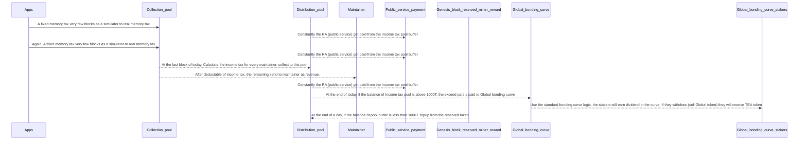

## Blog Posts
- [Two Minute Teaser](https://teaproject.medium.com/tea-project-2-minute-teaser-98d5744be4e3)
- [TEA Project: Moving from Cloud Computing to Web3](https://teaproject.medium.com/tea-project-moving-from-cloud-computing-to-web3-9e0bb5443c92)
- [TEA Project: Filling the gap between cloud apps and dApps](https://teaproject.medium.com/tea-project-filling-the-gap-between-cloud-apps-and-dapps-99ff7bb4b408)
- [TEA vs Blockchain](https://medium.com/@teaproject/tea-vs-blockchain-ca31b2e438b3)
- [TEA vs IPFS](https://medium.com/@teaproject/tea-vs-ipfs-f37202a33fc)
- [TEA vs Trusted Computing](https://medium.com/@teaproject/tea-vs-trusted-computing-1224745f1664)
- [Disaster prevention](Disaster-Prevention.md)
- [How big is the market?](https://medium.com/@teaproject/tea-project-disrupting-cloud-computing-market-size-estimation-347b814688db)
- [Who are the founders and core team members?](https://github.com/tearust/teaproject/wiki/The-TEA-Project-Core-Team)
- [TEA Project outstanding features compared to other competitors](https://medium.com/@teaproject/tea-project-competitors-d62f53c05bcf)
- [TEA and WebAssembly](https://medium.com/@teaproject/tea-and-webassembly-89991a83bbd1)
- [Is TEA secure and reliable?](https://medium.com/@teaproject/tea-project-security-reliability-and-robustness-b43013b1740)
- [What is TEA's governance structure?](https://github.com/tearust/teaproject/wiki/Governance-Structure)
- [Why do you say the Internet is broken?](https://medium.com/@teaproject/fixing-a-broken-internet-728f9f0b6df3)
- [How could TEA fix the Internet?](https://medium.com/@teaproject/how-tea-fixes-the-internet-a944dfe2db39)
- [A long article on the TEA token economy - CML and TEA](https://medium.com/@teaproject/challenges-in-the-tea-token-economy-design-cf928a06679b)
- [How will the business model support the token price?](https://medium.com/@teaproject/the-tea-token-model-how-does-the-business-support-value-price-ff5f8278e4fc)
- [How TApps Benefit Everyone in the TEA Ecosystem (includes use cases)](https://medium.com/@teaproject/how-tea-project-tapps-benefit-everyone-7c3d59284205)

#### Mermaid example

## Example 2

#### Fund flow at this stage

