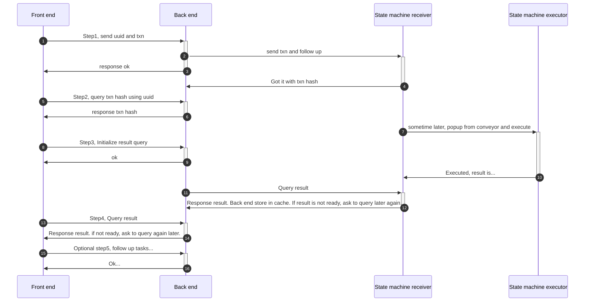

The code is located at https://github.com/tearust/tapp-sample-teaparty/tree/demo-code/party-fe. You can clone the code to a local repo to make it easier to go through.

This is a standard Vue application. We assume that readers are familar with VUE and front-end web technologies. Below we'll only focus on the TEA related parts.

# bbs.vue common requests functions
This file https://github.com/tearust/tapp-sample-teaparty/blob/demo-code/party-fe/src/views/bbs.js handles most message-related user interactions.

For example, the code snippets below are handling a load message and send message request:
```
async loadMessageList(address, channel=default_channel){
    // F.top_log("Query message list...");
    const rs = await _axios.post('/tapp/loadMessageList', {
      tappId: F.getTappId(),
      channel: F.getChannel(channel),
      address: '',
    });

    // F.top_log(null);

    if(!rs) return [];

    return F.formatMessageList(JSON.parse(rs));

  },
  async updateTappProfile(address){
    const user = F.getUser(address);
    if(!user || !user.isLogin){
      throw 'not_login';
    }
    // TODO if user is not owner, return;

    const opts = {
      tappId: F.getTappId(),
      address,
      authB64: user.session_key,
      postMessageFee: 100,
    };
    const rs = await sync_request('updateTappProfile', opts);
    console.log('updateTappProfile => ', rs);
    return rs;
  },
  async sendMessage(address, msg, channel=default_channel, ttl=null){
    const user = F.getUser(address);
    if(!user || !user.isLogin){
      throw 'Not login';
    }
    
    msg = utils.forge.util.encodeUtf8(msg);
    const encrypted_message = utils.forge.util.encode64(msg);
    // console.log(121, utils.crypto.encode(address, msg));
    
    // const decode_msg = utils.crypto.decode(address, utils.forge.util.decode64(encrypted_message));
    // console.log('decode_msg => '+decode_msg);

    const opts = {
      tappId: F.getTappId(),
      address,
      channel: F.getChannel(channel),
      // message: msg
      encryptedMessage: encrypted_message,
      authB64: user.session_key,
      ttl,
    };
console.log('message => ', opts)
    let rs = null;
    if(opts.channel === 'test'){
      // free msg
      rs = await _axios.post('/tapp/postFreeMessage', {
        ...opts,
        uuid: uuid(),
      });
    }
    else{
      const txn = require('./txn').default;
      rs = await txn.txn_request('postMessage', opts);
    }
    
    return rs;
  },
  ```
  You probably have noiticed that the most improtant line related to TEA is the line `await _axios.post('/tapp/loadMessageList'`
 for querying mesages, and this line `await txn.txn_request('postMessage', opts);
 for posting message.

You might have noticed that this line `await _axios.post('/tapp/postFreeMessage',` also looks like it's sending a command, but why is it not using `txn.txn_request()`? Well, posting a message does look like a command, but the free message doesn't cost anything. Therefore there is no state change (no money transfer). It can be comfortably handled by the [[hosting_CML]] alone without notifying the [[State_Machine]]. No matter if it's [[queries]] or [[commands]], they are concepts related to the [[State_Machine]] and not your application. 

# txn.txn_request
the `_axios.post` is a standard http call which doesn't need to be explained. We can focus on the txn.txn_request utility function.

The code is under views/txn.js. Almost the entire file is comprised of this function.
```
import {_, axios, moment, uuid} from 'tearust_utils';
import utils from '../tea/utils';
import bbs from './bbs';

const F = {

  async txn_request(method, param){
    const _uuid = uuid();
    console.log("prepare for txn: ", method, _uuid);
    
    const _axios = bbs.getAxios();

    const txn_uuid = 'txn_'+_uuid;
    try{
      bbs.log("Send txn request...");
      console.log("Send txn request...");
      const step1_rs = await _axios.post('/tapp/'+method, {
        ...param,
        uuid: txn_uuid,
      });
      console.log("step_1 result: ", step1_rs);
    }catch(e){
      console.error("step_1 error: ", e);

      throw e;
    }

    bbs.log('Wait for query txn hash...');
    console.log('Wait for query txn hash...');
    await utils.sleep(5000);

    let step_2_rs = null;
    const step_2_loop = async ()=>{
      try{
        console.log('query result for '+txn_uuid+'...');
        step_2_rs = await _axios.post('/tapp/query_result', {
          uuid: txn_uuid,
        });

        step_2_rs = utils.parseJSON(step_2_rs);
      }catch(e){
        console.log("step2 error: ", e);
        // rs = e.message;
        step_2_rs = null;
        await utils.sleep(3000);
        await step_2_loop();
      }
  
    };
  
    bbs.log("Start to query txn result...");
    console.log("Start to query txn result...");
    await step_2_loop();

    console.log("step2 result: ", step_2_rs);

    bbs.log('Wait for next step...');
    console.log('Wait for next step...');
    utils.sleep(5000);

    const step_3_hash = step_2_rs.hash;
    const hash_uuid = "hash_"+_uuid;
    let step_3_rs = null;
    let step_4_rs = null;
    let sn = 0;
    const step_4_loop = async ()=>{
      if(sn > 10) {
        step_4_rs = {
          'status': false,
          'error': 'request timeout',
        };
        return;
      }
      try{
        bbs.log("Send query txn hash request...");
        console.log('Send query txn hash request...');
        step_3_rs = await _axios.post('/tapp/queryHashResult', {
          hash: step_3_hash,
          uuid: hash_uuid,
        });
    
        bbs.log('Wait for query txn hash result...');
        console.log('Wait for query txn hash result...');
        await utils.sleep(5000);

        console.log('query hash result for '+hash_uuid+'...');
        step_4_rs = await _axios.post('/tapp/query_result', {
          uuid: hash_uuid,
        });

        step_4_rs = utils.parseJSON(step_4_rs);
        if(!step_4_rs.status) throw step_4_rs.error;
      }catch(e){
        console.log("step4 error: ", e);

        if(e !== 'wait'){
          throw e;
        }
        
        // rs = e.message;
        step_4_rs = null;
        sn++;
        await utils.sleep(5000);
        await step_4_loop();
      }
  
    };
  
    bbs.log("Start to query hash result...");
    console.log("Start to query hash result...");
    await step_4_loop();

    console.log("step4 result: ", step_4_rs);
    if(step_4_rs.error){
      throw step_4_rs.error;
    }

    if(!step_4_rs.need_query){
      return step_4_rs;
    }

    // continue query

    let step_5_rs = null;
    let step_5_uuid = step_4_rs.query_uuid || _uuid;
    let step_5_n = 0;
    const step_5_loop = async ()=>{
      if(step_5_n > 3){
        throw 'query timeout...';
      }
      try{
        console.log('continue query for '+step_5_uuid+'...');
        step_5_rs = await _axios.post('/tapp/query_result', {
          uuid: step_5_uuid,
        });

        step_5_rs = utils.parseJSON(step_5_rs);
      }catch(e){
        console.log("step5 error: ", e);
        step_5_n ++;
        step_5_rs = null;
        await utils.sleep(5000);
        await step_5_loop();
      }
    };

    bbs.log("Start to query action result...");
    console.log("Start to query action result...");
    await step_5_loop();
    console.log("step5 result: ", step_5_rs);

    const rs = step_5_rs;

    return rs;
  }

};


export default F;
```

This is a big function, so let's dig into it step by step.

# uuid
Before the first step, we generate a UUID. This is used for a future results query (ecause all txns are async calls). You're not supposed to get a response immediately. You have to query after a period of time, and then from time to time until you get the result: either success or fail. UUID is the handle for such queries.

Once the UUID is confirmed, it uses an http call to the [[hosting_CML]] like this:
```
const step1_rs = await _axios.post('/tapp/'+method, {
        ...param,
        uuid: txn_uuid,
      });
```
The [[hosting_CML]] will handle this txn and run the back-end logic accordingly. If you are interested in that part, go to [[back_end_actor]].

# txn_hash
The result from step1 doesn't mean anything. It just says "hey I accepted your txn request". In order to query the result of such a txn, we need to have the hash of that txn. We don't know it at this moment. The only thing we know is the UUID. So the step2 should query the txn_hash using the UUID. You can see the code below:
```
let step_2_rs = null;
    const step_2_loop = async ()=>{
      try{
        console.log('query result for '+txn_uuid+'...');
        step_2_rs = await _axios.post('/tapp/query_result', {
          uuid: txn_uuid,
        });

        step_2_rs = utils.parseJSON(step_2_rs);
      }catch(e){
        console.log("step2 error: ", e);
        // rs = e.message;
        step_2_rs = null;
        await utils.sleep(3000);
        await step_2_loop();
      }
  
    };
```
The result of step2 is the txn_hash. Now the front-end has the txn hash and the back-end has sent the txn to the [[State_Machine]]. But we haven't got the result yet. In order to get the result, the front-end needs to ask the [[back_end_actor]] to initialize a series of [[queries]] to the [[State_Machine]] to get the result of the transaction. Step3 performs this "initialization" request.

```
step_3_rs = await _axios.post('/tapp/queryHashResult', {
          hash: step_3_hash,
          uuid: hash_uuid,
        });
    
```

Now, the [[back_end_actor]] receives the request and starts querying the [[State_Machine]] for the result. Because this is an async call, the back-end cannot get the result immediately. It will keep polling several times to get the result. When the back-end receives the result, it will cache it in memory for a short period of time, waiting for the [[front_end]] to fetch it. Step4 actually did the "fetching" job.

```
step_4_rs = await _axios.post('/tapp/query_result', {
          uuid: hash_uuid,
        });

        step_4_rs = utils.parseJSON(step_4_rs);
        if(!step_4_rs.status) throw step_4_rs.error;
      }catch(e){
        console.log("step4 error: ", e);

        if(e !== 'wait'){
          throw e;
        }
        
```

There are a few meaningful parameters in the step_ r_rs result. For example, do I need to wait and query again? This happens if the [[back_end_actor]] has not received the result from the [[State_Machine]] yet. 

For most txns, as long as step4 has received the answer, the whole process is done. But for some txns, there are some follow-up tasks after the result. This is what step5 is supposed to do.
```
let step_5_rs = null;
    let step_5_uuid = step_4_rs.query_uuid || _uuid;
    let step_5_n = 0;
    const step_5_loop = async ()=>{
      if(step_5_n > 3){
        throw 'query timeout...';
      }
      try{
        console.log('continue query for '+step_5_uuid+'...');
        step_5_rs = await _axios.post('/tapp/query_result', {
          uuid: step_5_uuid,
        });

        step_5_rs = utils.parseJSON(step_5_rs);
      }catch(e){
        console.log("step5 error: ", e);
        step_5_n ++;
        step_5_rs = null;
        await utils.sleep(5000);
        await step_5_loop();
      }
```

Now the whole txn workflow is completed.

# Workflow
To make the workflow clear and visual, let's draw a sequence diagram.


