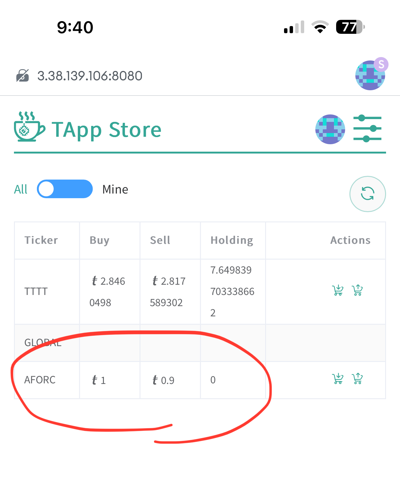

# Togar3 Game: Tea Open agar.io for Web3

Togar3 stands for Tea Open agar.io for Web3. It is a web3 modified version of [agar.io game](https://en.wikipedia.org/wiki/Agar.io) based on [Ogar3](https://github.com/Faris90/Ogar3) open source project. 

## Togar3 as an Airdrop

While Togar3 is a thrilling game experience, it also doubles as an innovative airdrop tool designed to distribute TEA tokens to our valued community members.

Unlike traditional airdrops where token acquisition relies solely on chance, Togar3 offers a more engaging and interactive approach:

* Forget passive drops: Instead of directly distributing TEA tokens, we airdrop "food" and "bots" within the game itself. Players then compete with each other and AI-controlled bots to collect this valuable in-game currency.
* Food = value: Each piece of food functions as a "bonding-curve" token, meaning its value increases as more players acquire it. This creates a dynamic in-game economy where players can strategically collect and sell their food for TEA tokens on the TEA Project platform.
* Unlock your TEA: Once you've accumulated TEA tokens, the possibilities are endless! Use them to cover gas fees, swap them for other ERC20 tokens on Uniswap, or explore the various utilities offered within the TEA ecosystem.

With Togar3, airdrops become an exciting adventure, rewarding players for their skills and engagement within the game world. So, are you ready to join the fun and claim your share of the TEA bounty? Dive into Togar3 today!

## Tutorial

**Ready to join the Togar3 airdrop and collect your share of TEA tokens?** This guide will walk you through the simple steps to get started.

### Before you start

Download Metamask: Togar3 is a TEA App, and all TEA Apps require Metamask to run. Follow the [instruction here](./_b02_Metamask%20connect.md) to install Metamask on your computer browser or iOS device (Android support coming soon!).
Verify Metamask connection: Once you have Metamask installed, follow [look up account here](./_1_TAppStore_0_account.md)d to verify it’s working correctly.

### Step 1: Land on the Tea Project Website

Access the landing page: You likely learned about the Togar3 airdrop from a tweet. Follow the link to reach the landing page. Remember, this URL might change when Togar3 launches on the mainnet.
Head to TeaFluencer: The landing page will guide you to the TeaFluencer platform at https://alpha.teaproject.org/#/node/0/fluencer/go.

### Step 2: Complete the Game host's Task in TeaFluencer:

<iframe width="560" height="315" src="https://www.youtube.com/embed/NKYdzKNsCWM" frameborder="0" allow="autoplay; encrypted-media; picture-in-picture" allowfullscreen></iframe>

**Earn your food:** Watch the embedded video (or use the provided link) and complete the task (e.g., retweet a post) to earn 300 food, the minimum requirement for the airdrop.
**Retweet and Apply:** Click the "Visit" button to access the retweet task on Twitter. Use your Twitter account to retweet the specified post and copy the retweet URL. Paste the URL into the "Apply airdrop" section on the TeaFluencer page and confirm.
**Enter the Game:** Once confirmed, click the "Enter game" button to launch the Togar3 game.

### Step 3: Play Togar3 and Claim Your Food

**Airdrop notification:** Upon entering the game, you'll receive a notification confirming your successful airdrop and your 300 food balance.
**Start playing:** Click "Join" to enter the game and begin your food-collecting adventure!

**How to play? What are the game rules?**, please continue [reading](#togar3-game-rules)

### Step4: Protect Your Food with Z-Transfer

**Save your progress:** While playing, press the "Z" key (on computers) or tap the "Transfer" button (on mobile) to transfer your collected mass to your game account. This ensures you don't lose everything if another player "eats" you.
**Check your balance:** Keep track of your progress by pressing "Esc" (on computers) or tapping the "Pause" button anytime during the game.

### Step5: Unload Your Food and Claim Your TEA Tokens

Remember, your game account is temporary storage. Once you leave the game, your saved mass automatically transfers to your TEA Project account, where you can claim your TEA tokens.

That's it! You've successfully participated in the Togar3 airdrop and are well on your way to collecting valuable TEA tokens. Enjoy the game and explore the exciting possibilities of the TEA ecosystem!

\*\*What am I gonna do with my game token? \*\*, please continue [reading](#sell-game-token-for-tea).

     Airdrop short video

## Togar3 vs Ogar3

Comparing with web2 version Ogar, there are major improvements specificly designed for Web3 concepts:

* Mass is money: Unlike Ogar3's score system, your mass in Togar3 represents real tokens with monetary value.
* Solo play: While teaming isn't prevented, Togar3 focuses on individual competition.
* Dynamic mass balance: Larger cells move faster but consume more food, losing the excess to the Food Bank. This bank generates new food when supplies dwindle.
* Balanced entry fee: Players contribute 300 food (10 mass + 290 to the Food Bank) upon joining. Earning 290 mass breaks even, and the TeaFluencer airdrop covers this fee.
* Z-transfer for safety: Press Z (or use the mobile transfer button) to save your mass to your bank account, protecting it even if you're eliminated.
* Timed rounds and fresh starts: Each game session lasts 30 minutes per player, with a total round duration of 1 hour (subject to change). At the end, everyone keeps their earned tokens and a new round begins.

## Togar3 game rules

<iframe width="560" height="315" src="https://www.youtube.com/embed/fKfGEGbq4uY" frameborder="0" allow="autoplay; encrypted-media; picture-in-picture" allowfullscreen></iframe>

https://youtube.com/shorts/fKfGEGbq4uY?si=C9gL3RrWAEQsYbBT     Game play short video

## Player strategy and tips

## Sell game token for TEA
