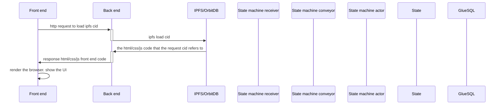

In this section, we'll walk through the TEA Party application's sample code. 

The steps are:

- Clone the code to local.
- Install the build tools.
- Understand the folder structure.
- Understand the compile workflow.
- Run it.

# Code location and structure

Start by cloneing the following GitHub repo to your local machine:
https://github.com/tearust/tapp-sample-teaparty

There are 4 folders (click the following links for more details):

- [[party-fe]]: This is the [[front_end]].
- [[party-actor]]: This is the [[back_end_actor]].
- party-share: This is the common data structure or library that shared by both the [[back_end_actor]] and the [[state_machine_actor]].
- [[party-state-actor]]: This is the [[state_machine_actor]].

# Workflow

## Load the UI 

Any user can launch a TApp by clicking on one of the [[hosting_CML]]s urls (there's no domain used when launching TApps). Picking any of the urls will work exactly the same so you can choose the one with least network latency. The URL is nothing but an IPFS CID.

Note: This is a brief diagram. The real communication is more complicated than this.

