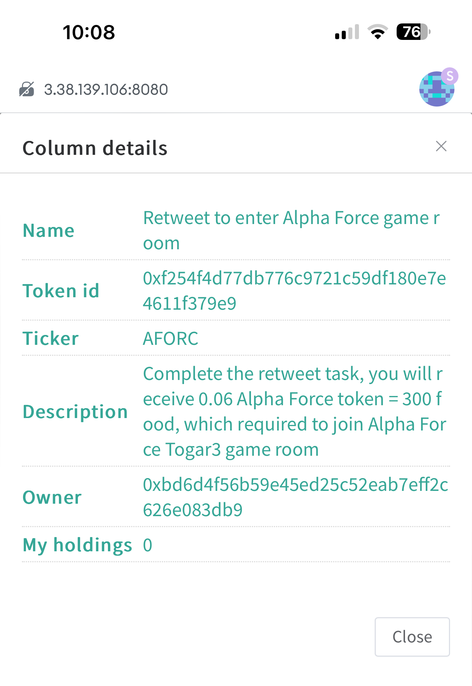
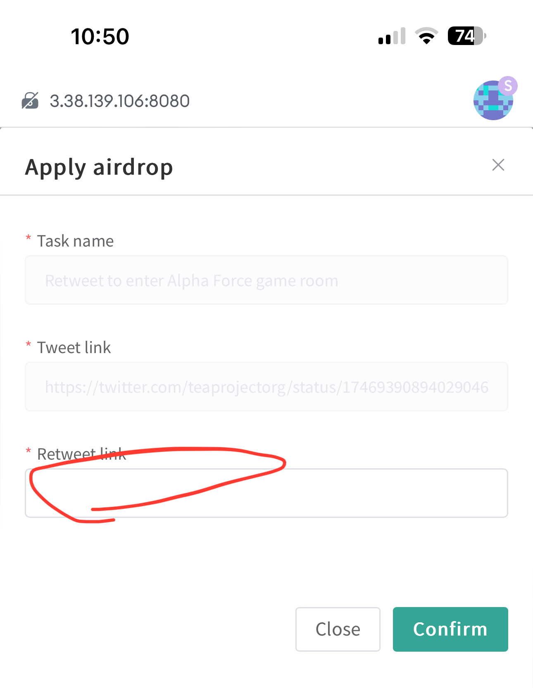
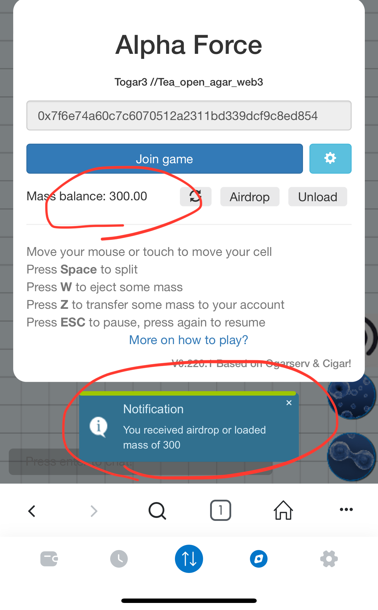

# Togar3 Game: Tea Open agar.io for Web3

Togar3 stands for Tea Open agar.io for Web3. It is a web3 modified version of [agar.io game](https://en.wikipedia.org/wiki/Agar.io) based on [Ogar3](https://github.com/Faris90/Ogar3) open source project. 
 

## Togar3 as an Airdrop
While Togar3 is a thrilling game experience, it also doubles as an innovative airdrop tool designed to distribute TEA tokens to our valued community members.

Unlike traditional airdrops where token acquisition relies solely on chance, Togar3 offers a more engaging and interactive approach:
- Forget passive drops: Instead of directly distributing TEA tokens, we airdrop "food" and "bots" within the game itself. Players then compete with each other and AI-controlled bots to collect this valuable in-game currency.
- Food = value: Each piece of food functions as a "bonding-curve" token, meaning its value increases as more players acquire it. This creates a dynamic in-game economy where players can strategically collect and sell their food for TEA tokens on the TEA Project platform.
- Unlock your TEA: Once you've accumulated TEA tokens, the possibilities are endless! Use them to cover gas fees, swap them for other ERC20 tokens on Uniswap, or explore the various utilities offered within the TEA ecosystem.

With Togar3, airdrops become an exciting adventure, rewarding players for their skills and engagement within the game world. So, are you ready to join the fun and claim your share of the TEA bounty? Dive into Togar3 today!

## Tutorial
**Ready to join the Togar3 airdrop and collect your share of TEA tokens?** This guide will walk you through the simple steps to get started.

### Before you start

Download Metamask: Togar3 is a TEA App, and all TEA Apps require Metamask to run. Follow the [instruction here](./_b02_Metamask%20connect.md) to install Metamask on your computer browser or iOS device (Android support coming soon!).
Verify Metamask connection: Once you have Metamask installed, follow [look up account here](./_1_TAppStore_0_account.md)d to verify it’s working correctly.

The follow screenshot shows how Togar3 is loaded into Metamask on iPhone.

### Step 1: Land on the Tea Project Website

Access the landing page: You likely learned about the Togar3 airdrop from a tweet. Follow the link to reach the landing page. Remember, this URL might change when Togar3 launches on the mainnet.
Head to TeaFluencer: The landing page will guide you to the TeaFluencer platform at https://alpha.teaproject.org/#/node/0/fluencer/go.

Please watch the short video below
 
### Step 2: Complete the Game host's Task in TeaFluencer:

- **Earn your food:** Watch the embedded video (or use the provided link) and complete the task (e.g., retweet a post) to earn 300 food, the minimum requirement for the airdrop. You will need to login TeaFluencer app. 

For detail of the task, and related game room, click anywhere in this row

- **Retweet and Apply:** Click the "Visit" button to access the retweet task on Twitter. Use your Twitter account to retweet the specified post and copy the retweet URL. Paste the URL into the "Apply airdrop" section on the TeaFluencer page and confirm.

- **Enter the Game:** Once confirmed, 

click the "Enter game" button to launch the Togar3 game.
### Step 3: Play Togar3 and Claim Your Food

**Airdrop notification:** Upon entering the game, you'll receive a notification confirming your successful airdrop and your 300 food balance.

**Start playing:** Click "Join" to enter the game and begin your food-collecting adventure!

**How to play? What are the game rules?**, please continue [reading](#togar3-game-rules)

### Step4: Protect Your Food with Z-Transfer

**Save your progress:** While playing, press the "Z" key (on computers) or tap the "Transfer" button (on mobile) to transfer your collected mass to your game account. This ensures you don't lose everything if another player "eats" you.
**Check your balance:** Keep track of your progress by pressing "Esc" (on computers) or tapping the "Pause" button anytime during the game.

### Step5: Unload Your Food and Claim Your TEA Tokens
Remember, your game account is temporary storage. Once you leave the game, your saved mass automatically transfers to your TEA Project account, where you can claim your TEA tokens.

That's it! You've successfully participated in the Togar3 airdrop and are well on your way to collecting valuable TEA tokens. Enjoy the game and explore the exciting possibilities of the TEA ecosystem!

**What am I gonna do with my game token? **, please continue [reading](#sell-game-token-for-tea).

## Togar3 vs Ogar3
Comparing with web2 version Ogar, there are major improvements specificly designed for Web3 concepts:
- Mass is money: Unlike Ogar3's score system, your mass in Togar3 represents real tokens with monetary value.
- Solo play: While teaming isn't prevented, Togar3 focuses on individual competition.
- Your Metamask address is your name.
- Dynamic mass balance: Larger cells move faster but consume more food, losing the excess to the Food Bank. This bank generates new food when supplies dwindle.
- Balanced entry fee: Players contribute 300 food (10 mass + 290 to the Food Bank) upon joining. Earning 290 mass breaks even, and the TeaFluencer airdrop covers this fee.
- Z-transfer for safety: Press Z (or use the mobile transfer button) to save your mass to your bank account, protecting it even if you're eliminated.
- Timed rounds and fresh starts: Each game session lasts 30 minutes per player, with a total round duration of 1 hour (subject to change). At the end, everyone keeps their earned tokens and a new round begins.

## Togar3 game rules and strategies

### Basic rules:
**Dominate the Agar.io Food Chain**

Agar.io is a brutal world where size reigns supreme. Imagine a microscopic food chain - the smaller you are, the more likely you become someone's lunch. But fear not, tiny morsel! With the right knowledge and cunning, you can climb the ranks and become the apex predator.

**Know Your Enemies**

- **Giants:** These lumbering behemoths pack a punch, but their slowness makes them sitting ducks. Avoid them unless you have a well-crafted plan (and maybe a few friends).
- **Equals:** Locked in a stalemate? Size doesn't guarantee victory. Outsmart your opponent with clever maneuvering and strategic use of the arena.
- **Viruses:** Spiky traps disguised as cells, viruses explode upon contact, sending large prey flying in bite-sized chunks. Use them wisely!
**Size Matters**
- **Growing Pains:** Bigger cells are like luxury yachts - powerful but slow. Remember, the bigger you are, the more energy you burn moving around.
- **Tiny Terror:** Small cells are the nimble ninjas of Agar.io. They zip around effortlessly, consuming little energy, making them perfect for escapes and surprise attacks.
**Master the Tools**
- **Spike Launcher (W Key):** Feed mass to those spiky viruses. Once they reach a critical size, they explode, sending out deadly spikes. Lure larger enemies into these and watch them split into delicious snacks!
- **Virus Hideout:** Smaller cells, rejoice! You can safely hide inside viruses, giving you a temporary shield from hungry giants.
- **Cell Splitter (Space Key):** Feeling sluggish? Split your cell in two for a burst of speed, perfect for catching prey or escaping danger. Remember, though, smaller cells are easier to eat!
**Remember**
- **Don't Eat Viruses (if you're big):** It might seem tempting, but remember, viruses are like ticking time bombs for large cells. One bite and you'll be scattered across the map, predator turned prey.
- **Split Strategically:** Splitting is a powerful tool, but use it wisely. Splitting for speed can help you catch smaller prey or escape danger, while splitting to consume can help you take down larger enemies.

With these tips and a dash of practice, you'll be dominating the Togar3 food chain in no time! Remember, the key is to be adaptable, strategic, and maybe a little bit ruthless. So go forth, tiny cell, and conquer!

**Some tips and strategies:**
- **Maintain a Reasonable Size:** Growing too large can become costly in terms of movement. Sometimes, you might lose more mass than you can consume. Press Z to transfer excess mass to your game account to reduce size. This also enhances your movement speed, ensuring you retain some mass even after losing some.

- **Split into Smaller Cells:** Splitting into smaller cells allows for faster movement and more efficient feeding, provided you feel safe. Consuming viruses causes your cell to divide, granting you additional mass (100 mass).

- **Utilize Viruses for Protection:** Only larger cells are vulnerable to being split by viruses. If you're a smaller cell being pursued by a larger one, consider maneuvering near a virus to shield yourself from being consumed.

**Time Limit for Each Round:**

The Togar3 server undergoes a restart every few hours, signaling the start of a new round. Upon joining the game, you'll observe the remaining duration of the current round displayed in minutes. Additionally, every player is allotted a specific playtime limit, which can be monitored in the top left corner, indicating the remaining seconds.

Failure to complete your round within the allocated time will prevent you from rejoining until the next server restart.

Upon reaching the time limit, you'll be automatically logged out of the game. However, any remaining mass within your cells will be transferred to your game bank account, where it will be converted into "game tokens" for the TEA Project. These tokens can be redeemed and utilized in subsequent rounds.

## Sell game token for TEA
You can utilize the [TAppStore Investment](./_1_TAppStore_2_Investments.md) platform to sell your game tokens to TEA. Subsequently, you can seamlessly swap these tokens for any other ERC20 token using the Uniswap protocol.

