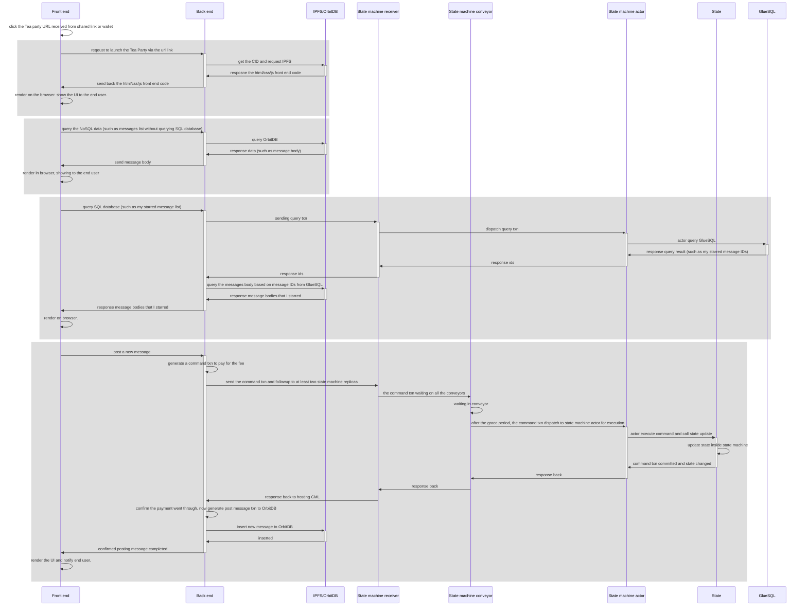

**TEA Party** is a demo [[What_makes_a_Web3_application| Web3.0]] application running on the TEA Project. 

# The goal of TEA Party
We built the TEA Party TApp to show: 

- What a typical [[What_makes_a_Web3_application|Web3.0]] App (We call them TApps) looks like.

- The building blocks of a typical TApp.

- How to use Tea Party as a boilerplate to build your own TApps.

The TEA Party TApp is a useful social media application. Users can post messages to a public board as well as send private messages with notifications. See [[how_to_use_TEA_Party]] for more information.

# TApp is designed for [[What_makes_a_Web3_application|Web 3]]
As is the case with all TApps, the TEA Party showcases the special features that are beyond the capabilities of other cloud based internet (web 2.0) applications. Instead of centralized server(s) hosting the app, the individual miners of the TEA network host TApps based solely on their own [[hosting_profitability]]. The inherent decentralization that all TApps including the TEA Party share gives these apps even more unique features:

- They cannot be turned off by any centralized power. As long as there are a minimal number of miners hosting any particular application, it will continue to run forever.

- No one, including the host miner, can control or censor the content. The content is owned and protected by its creator's private key. A miner can choose to stop hosting the TApp, but it cannot selectively choose what content to show or hide.

- There's no free lunch. Every action that costs any computing resources needs to be paid by someone. In TEA Party's particular case, every message sent needs to be paid for. Additional charges also apply to store the message or to notify the recipient. For further information, see [[Where_the_message_is_stored?]]

In order to get the features above, the underlying technical layer is very different from the existing cloud computing and blockchain tech stacks. It's a new tech stack that's based on recent technologies.  However, the developers do not need to understand the complicated low level distributed system, they can build application **as if** it is still a centralized cloud computing architecture. This is the **charm of the TEA Project**.

The following sections will explain the cutting edge technologies used in the TEA Party. We hope explaining the underlying technologies and how they work together will help you make your own TEA applications (TApps).

# Three Major Parts
The full architecture of the TEA Project is complicated but there are only three majors parts where an application developer will be working. These three major parts all run in different locations just like the traditional 3-tier-architecture of cloud computing web apps. 

## [[front_end]]
This is a typical JS application (for webapps), or a mobile application (for mobile apps). The front-end is running inside of a browser or mobile device.

## [[back_end_actor]]
This WebAssembly code is running inside of a hosting node. The hosting node is a miner's computer which has a CML planted. It's similar to the server logic running in back-end servers or application servers in the traditional cloud computing architecture.

## [[state_machine_actor]]
This WebAssembly code is running inside the state machine's [[mini-runtime]]. It's equivalent to the stored procedure (SQL for example code) in the traditional 3-tier architecture's database.

# [[3_tier_architecture]] basic workflow
The above 3 components are directly mapped to the traditional 3-tier architecture of a typical cloud computing application.

The basic workflow would look like this: 
(this example uses a web-based TApp)

- The user generates a user action in the front-end. The Javascript web client catches the user action, generates a web request, and sends it to the backend.
- The back-end receives the web request and runs the Tea Party back-end code (we call it the back-end actor) to handle anything that does not need the state machine (traditionally, this is referred to as a database). But when it needs to query or update a state in the state machine, it will need to generate a request to the state machine tier. These can be broken down into [[queries]] (will not change the state) and [[commands]] (potentially could change the state). Commands are typically called [[txn]]s in the blockchain industry. 
- The queries and commands are handled by the state machine replications. For queries, it will look up the local state and send the result back. For commands, as one of the replications, it should not modify on its own. Instead, it generates a txn and puts it in a global queue that we call the [[conveyor]]. The replicas run a Proof of Time consensus to guarantee that all state machines in all replicas get the same [[order_of_txns]]. This ensures that their state can always be kept identical after executing the command. This is the same methodology as is typically used by a distributed database system.

# Storage
There are three types of storage options for different use cases.
- [[OrbitDb]]: Based on IPFS / used for large blob storage. It's running on the [[hosting_CML]].
- [[state|State]]: Usually used to store account balance. It runs inside the [[State_Machine]].
- [[GlueSQL]]: Distributed SQL server instances. It's located inside the [[State_Machine]].

## Comparison between the three storage options

| Storage options | Relational? | Cost | Consistency type | Use cases in Tea Party |
| -----------------|------------|-------|-------------------|--------------------|
| OrbitDb (on IPFS) | Non-relational | Low | Eventual consistency | Message body & attachments |
| State | Non-relational | High | Strong consistency | Account balance |
| GlueSQL | Relational (SQL) | High | Strong consistency | Not yet in use but can be used in common SQL business logic|

# Comparison with a cloud webapp's 3-tier architecture
 
| User action | step  | Eth based dApps |cloud webapp | TEA project |  Note |
|-------------|-------| ------|---------------|-------------|-------|
| Clicks the app to start | Start a web app | N/A | Go to a domain name, usually https://yourapp.com | Click the app name in your TEA wallet, you'll receive a list of hosting CMLs. Click any of them | Cloud webapp has a centralized http/https domain name, but TEA doesn't have such a centralized control. Every hosting miner are seperate from each other |
| Show the UI in the browser | Load front-end code in the browser | N/A | Download the [[front_end]] code (js/html/css) from a webserver | Download the front end from IPFS or any decentralized storage | TEA doesn't have a traditional web server. The front-end code and all static resources are stored in IPFS or some other decentralized storage. User will use the CID (hash) as a key to load the front-end code directly in the browser |
| Show dynamic content, such as list of all messages | Query database | Any client to query the block state | Browser sends request to the back-end server, back-end server then queries database for data. Send data all the way back to the browser to show on the UI | Browser request to hosting CML. The [[back_end_actor]] handles the request and then sends a P2P request to [[State_Machine_Replica]]. [[state_machine_actor]] queries the [[State_Machine]] then sends the data all the way back to the [[front_end]] | Depends on what type of content the UI queries. Some content can be directly queried from a hosting CML's local OrbitDB instance. Accounting information needs go to the state machine. The TEA project also provides a Glue SQL database if the data is stored in an SQL database. |
|  Create or update dynamic content, such as post new messages or extend existing messages | Send command to modify state | Send transaction to any ETH miner and wait for a new block |The same as above | [[front_end]] sends command to the [[back_end_actor]]. [[back_end_actor]] generates a transaction (or calls a command) and sends it to a [[State_Machine_Replica]] via P2P. The statemachine replica puts this transaction into the [[conveyor]] and then waits a grace period until the sequence of transactions reaches a consensus between more than 50% of replicas. Then load this transaction to the [[back_end_actor]] to execute the transaction which will update the state | There are many state machine replicas that keep a consistent state among them. So the Proof of Time is required to sync between replicas. |

# The requirements for building TApps
In this section, we'll list the knowledge and tools you'll need to build TApps.

## Tools
To build and run the demo locally, you'll need:

- A Mac or Linux machine. 
- Docker and docker-compose installed.
- Rust compiler.
- Web browser.

After building your own TApp, you can try hosting it by launching your own mining node. A mining node is any type of TEA node with a CML planted in it. If you don't own a physical TEA machine, you can rent an Amazon Nitro VM which is TEA-compatible.

## Programming languages

The demo TEA party app is written in the following languages:

- **Front-end** is written in JS and the Vue framework.
- **Back-end and State machien actors** are written using Rust and then compiled to WebAssembly.

The TEA Project doesn't require the developer to use the Rust programming language. You can use any programming language that compiles to WebAssembly. But at this moment, in order to understand our existing demo code, you'll need to use the Rust langauge. 

## Architecture knowledge

## Layer2 without Rollups
The TEA Project is considered a layer2 solution, but it has been designed with completely different mindset in comparison with existing roll-up solutions. We focus on providing a trustable computing infrastructure, hence why there's [[The_future_and_innovation_of_layer2#We Trust the Result by Verifying the Environment|no need to verify the computing results]]. This allows the dApps running on our infrastructure to run at full speed, similar to cloud computing.

## Layer2 decoupled with layer1
TEA Project runs [[The_future_and_innovation_of_layer2#Layer1 Agnostic|on top of different kinds of blockchains]] interchangeably due to there being no rollup required. The layer 1 blockchain provides one of the three Roots of Trust, with the other two roots of trust coming from hardware. 

## Hardware
The TEA Project is very different from many other blockchain projects. TEA relies on two types of hardware in order to reach a special type of consensus: 

- [[TPM]]
- [[GPS]]

Please click the above links to learn more about how and why the TEA Project uses these technologies.

If you just want to run the code in your local simulator, you don't need any of the above hardware. You can run our simulator using Docker to run a test environment.

If you want to host your application in a production environment, you'll need a TEA node. If you don't own one, the easiest way is to rent an Amazon Nitro VM.

# Code walk through

In this section, we'll walk through the TEA Party application's sample code. 

Please continue reading the [[code_walkthrough]].

# Basic workflow
In this section, we'll learn the basic workflow between all three tiers: how a user action get processed from the front-end to the state machine layer and back to the user.

# The magical Proof of Time state machine
In this section, we'll explain how the distributed state machine works, including how it handles consensus among different replicas.
Keep reading about the [[magic_of_state_machine]].

# Understand WebAssembly Runtime
In this section, we'll go through how the WebAssembly code runs inside the [[mini-runtime]]. 
Keep reading about the [[magic_of_wasm]].
